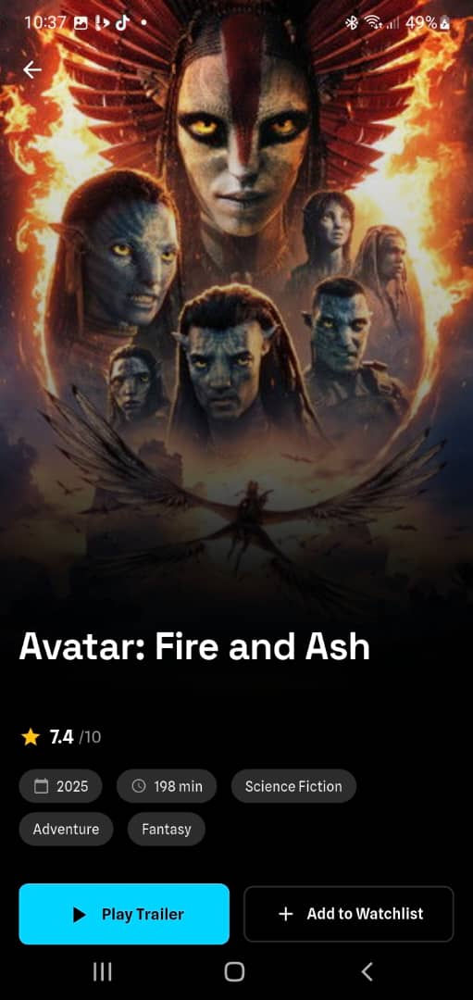
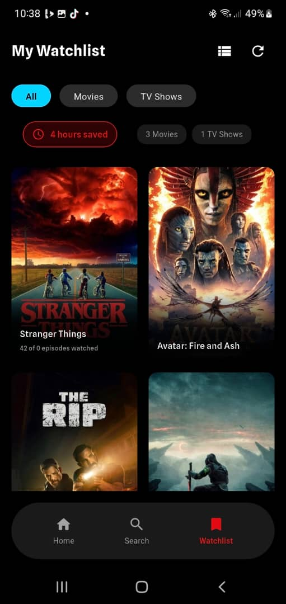
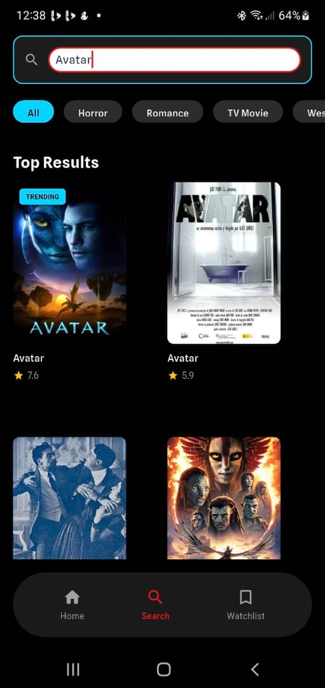

# FlickNova 🎬🍿

**A cinematic movie & TV discovery app** inspired by Netflix + Letterboxd — built 100% with Flutter for cross-platform excellence (Android, iOS, web, desktop).

Delivering a premium, immersive experience with dark theme, glassmorphic cards, smooth hero animations, shimmer placeholders, infinite scrolling, and offline watchlist support.

### Why This Project?
As a mid-level Flutter developer (4+ years), this MVP showcases my evolution in state management (from GetX to Riverpod), modern UI/UX patterns, performant API handling, and clean architecture — skills I've applied to deliver 99% crash-free production apps with 20%+ user engagement gains.

### Key Features
- **Powerful discovery** — Search, filter, and browse trending/popular movies & TV shows via TMDB API
- **Infinite pagination** — Smooth endless scrolling with shimmer loading states
- **Cinematic UI** — Dark mode with glassmorphism, blur effects, hero transitions, and blue/purple accents
- **Offline watchlist** — Add/remove titles, view stats, persists with Isar (fast local DB)
- **Cross-platform** — Runs beautifully on mobile, web, macOS, Windows
- **Clean & scalable** — Feature-first architecture, Riverpod for reactive state, proper error handling & loading states

### Tech Stack
- **Flutter** (latest stable) + **Dart**
- **State Management**: Riverpod (modern, testable, performant)
- **API**: TMDB (The Movie Database) with Dio or http client
- **Local Database**: Isar (lightning-fast, NoSQL for offline data)
- **UI Polish**: Custom themes, animations (Hero, AnimatedSwitcher), shimmer, glassmorphic effects
- **Other**: intl for formatting, flutter_launcher_icons, etc.

### Screenshots

Here are some quick glimpses of the dark, immersive UI in action:

<!-- Paste your actual screenshot URLs here after uploading them to the repo or using GitHub image hosting -->

### Demo & Testing
- **Video Demo**: [Quick walkthrough on X/Twitter](https://x.com/sule_ohis/status/2010648030488539403) (heroes, shimmers, glass cards)
- **Android APK**: Download & test the latest build → [Google Drive Link](https://drive.google.com/file/d/1Fl2v8CBGnLaE_vyKutQeXtPz-g2-ukVV/view?usp=sharing)
- **Live Web Demo** (if deployed): Coming soon!

### Getting Started (for reviewers/recruiters)
1. Clone the repo: `git clone https://github.com/suleohis/flicknova.git`
2. Get your free TMDB API key → https://www.themoviedb.org/
3. Create `.env` file in root with: `TMDB_API_KEY=your_key_here`
4. Install dependencies: `flutter pub get`
5. Run: `flutter run`

(Uses `flutter_dotenv` or similar — never commit keys!)

### License
MIT License — feel free to explore/learn from the code. Attribution appreciated for any inspiration!

### Let's Connect!
- LinkedIn: [linkedin.com/in/ephraim-sule](https://www.linkedin.com/in/ephraim-sule)
- X/Twitter: [@sule_ohis](https://x.com/sule_ohis)
- Portfolio: suleohis.github.io
- Open to **100% remote** roles or **EU relocation** (visa support welcome)

Feedback, code suggestions, or collaboration ideas? Open an issue or DM me — happy to discuss architecture decisions, Riverpod patterns, or how this ties into production apps I've shipped!

#Flutter #Riverpod #TMDB #MovieApp #FlutterDev #PortfolioProject